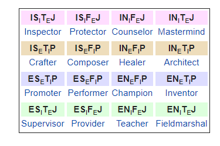

# Personality Prediction From Social Media ( Twitter )

A Natural Language Processing (NLP), Machine Learning and Data Mining project, which will automate the screening process before hiring a professional or can be used in psychiatry to check effectivity of patient therapy.

● Uses the Twitter REST API to mine tweets for personality identification.

● Create n-grams and word vectors for the hashtags, emoticons and phrases using NLP techniques like TF-IDF.

● Train the machine to classify the personality types by using a Naive-Bayes Text Classifier.

● Accurately predict the user’s Myers-Briggs personality type using 10-fold cross validation.

## Types of Personalities :

In Myer's Briggs Type indicator Classification we have 16 types of personality which can be categorized as : 

## How to RUN (WEB APP) :

1. First step is to run the requirement.txt file to install all the libraries and dependencies.
2. Edit tweepy_config.py and add your own Twitter keys
3. Run app.py
4. visit the url displayed on terminal

## How to RUN (Terminal Version) :

1. First step is to run the requirement.txt file to install all the libraries and dependencies.
2. Run MBTI tarining and testing/pyGen.py first to generate your naive bayes classifier models for all 4 different classes. It will generate few scores which will give the training data size and the features used while training the model.
3. Run MBTI tarining and testing/pyPredict(use your own Twitter keys) and enter the username you want to predict.
